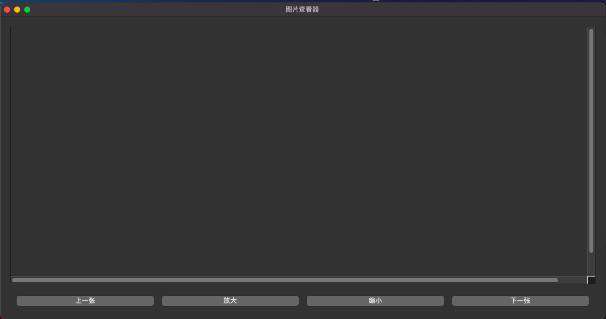

# ImageViewer
ImageViewer是一个简单的图片浏览器，它旨在解决MacOS自带图片查看器（预览）无法查看已打开图片同级目录下的其他图片。该项目只是个人实验性的工具，存在许多意想不到的问题，市面上有许多同类软件，在功能性和稳定性考量上选择后者。此外，目前版本仍在初始阶段，功能有限且界面简陋。
## 启动
1. 命令行模式启动
ImageViewer支持使用命令行参数启动，接受一个额外参数所谓打开的目录或者图片文件。可以直接使用Python运行```ImageViewer.py```文件，要求Python版本在3.8以及上。也可以使用打包生成的ImageViewer Unix执行文件运行命令。
```shell
python3 ImageViewer.py [图片文件路径或者文件目录]

./ImageViewer [图片文件路径或者文件目录]
```
2. GUI模式启动
双击ImageViewer.app文件，打开时会弹窗选择需要打开的图片文件。在菜单栏中可以选择打开文件和打开目录的两种方式载入图片。
## 功能
1. **打开图片文件或者文件夹**
   该方式会首先显示所选择目录下所有图片文件，如果存在的话，按照升序排序的第一张图片。
2. **前一张和后一张**
   所选目录或图片文件对应的目录下所有图片文件会组成一个环形数组，意味着会浏览回最开始的图片。
3. **放大和缩小** 
   提供```0.2, 0.4, 0.6, 0.8, 0.9, 1, 1.5, 2, 3, 4, 5, (假定正常尺寸) ,6, 8, 10, 13, 17, 20```以及正常尺寸共计18个档位的缩放比。正常尺寸是指在当前窗口下不改变原始图片的比例，所能显示的最大大小（有可能会缩放）。将缩放档位换算成与原始尺寸百分比对应为```500, 250, 166, 125, 111, 100, 66, 50, 33, 25, （假定正常尺寸）, 20, 16, 12, 10, 7, 5, 5```。在当前显示尺寸不等于正常尺寸时，调整窗口图片并不会自适应大小，只有当图片尺寸为正常尺寸大小时，图片才会随窗口的变化自适应调整。
## 打包
首先从github仓库中clone该项目，并在控制台进入项目根目录。
```shell
git clone https://github.com/magbone/ImageViewer.git
cd ImageViewer
```
ImageViewer使用pyinstaller库进行打包，在打包之前请先使用pip等工具安装pyinstaller。
```shell
pip(3) install pyinstaller
pyinstaller --windowed --onefile --clean --noconfirm ImageViewer.py
```
命令运行成功且没有错误可以在同级dist目录下看到ImageViewer.app文件以及ImageViewer Unix执行文件，前者文件就是最后所生成的应用程序双击即可运行，后者是Unix执行文件可以双击打开也可使用命令行的方式运行。如果在运行命令存在包缺失，由于本项目基于PyQt5进行开发，因此要保证安装PyQt5的包在设备上。
```shell
pip(3) install PyQt5
```

## 兼容性
兼容性未得到广泛测试，有待验证。
|  PC   | 系统  | Python | 图片
|  ----  | ----  | ---- | ---- |
| MacBook Air (13-inch, 2017)  | macOS Big Sur 11.5.2 | 3.10.8 (main, Oct 13 2022, 10:18:28) [Clang 13.0.0 (clang-1300.0.29.30)]| jpg, jpeg, png |

## TODO (May)
- [ ] 界面美化
- [ ] 图片旋转
- [ ] 支持更多图片类型
- [ ] 键盘以及触控板手势
  
## 预览


## License
MIT


